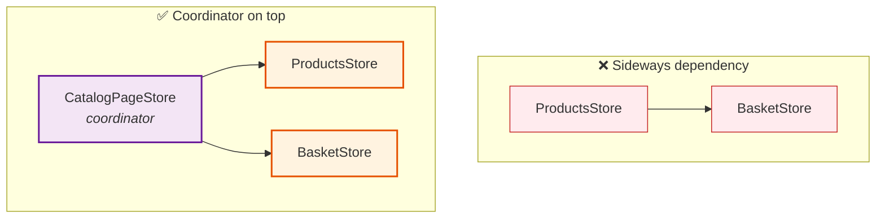

# How to coordinate stores without coupling them

When one store needs data from another — for example a `ProductsStore` that wants
to show an "already in your basket" badge — resist the urge to make the stores
depend on each other. Use a **coordinator** instead.

## The problem

The tempting move is to inject `BasketStore` directly into `ProductsStore`:

```TypeScript
export const ProductsStore = signalStore(
  withProps(() => ({ basket: inject(BasketStore) })), // 👈 direct dependency
  withComputed(({ basket }) => ({ /* read basket here */ })),
);
```

That works until it doesn't:

- **Coupling** — `ProductsStore` can no longer be understood, tested, or reused without `BasketStore` coming along for the ride.
- **Circular dependencies** — the day `BasketStore` needs anything from `ProductsStore` (e.g. enrich a basket line with the product name), you have `A → B` and `B → A`. Angular's DI will throw, or you'll paper over it with `forwardRef` and regret it.
- **Unclear ownership** — where does the cross-cutting "product + basket" concept live? It's smeared across both stores.

## The idea

Keep the feature stores as **independent leaves** — each owns exactly one slice of
state and knows nothing about the others. Then put a **coordinator** _above_ them
that depends on both and derives the combined view. Dependencies only ever point
**upward** (coordinator → stores), never sideways (store → store).



## The example

**Two independent stores** — neither imports the other:

```TypeScript
// basket.store.ts — knows about basket lines only
export const BasketStore = signalStore(
  { providedIn: 'root' },
  withEntities<BasketItem>(), // { productId, quantity }
  withComputed((store) => ({
    // exposing a Set makes the coordinator's lookup O(1)
    productIdsInBasket: computed(
      () => new Set(store.entities().map((item) => item.productId)),
    ),
  })),
  // withMethods: addItem, removeItem...
);

// products.store.ts — knows about the catalog only
export const ProductsStore = signalStore(
  { providedIn: 'root' },
  withEntities<Product>(),
  // withMethods: fetchProducts...
);
```

**The coordinator** — provided at the page/route level, injects both, and owns the
derived "already in basket" view:

```TypeScript
// catalog-page.store.ts
export const CatalogPageStore = signalStore(
  // NOT providedIn:'root' — scoped to the catalog page that needs the combination
  withProps(() => ({
    products: inject(ProductsStore),
    basket: inject(BasketStore),
  })),
  withComputed(({ products, basket }) => ({
    // the cross-store knowledge lives HERE, not in either leaf store
    productsWithBasketFlag: computed(() => {
      const inBasket = basket.productIdsInBasket();
      return products.entities().map((product) => ({
        ...product,
        alreadyInBasket: inBasket.has(product.id),
      }));
    }),
  })),
  withMethods(({ products }) => ({
    // it can also orchestrate actions across stores
    load: () => products.fetchProducts(),
  })),
);
```

The component talks only to the coordinator:

```TypeScript
@Component({
  selector: 'app-catalog-page',
  providers: [CatalogPageStore], // page-scoped
  template: `
    @for (product of store.productsWithBasketFlag(); track product.id) {
      <app-product-card
        [product]="product"
        [alreadyInBasket]="product.alreadyInBasket" />
    }
  `,
})
class CatalogPageComponent {
  protected readonly store = inject(CatalogPageStore);

  constructor() {
    this.store.load();
  }
}
```

## Why this is better

- `BasketStore` and `ProductsStore` stay **leaf, reusable, and independently testable** — you don't need to mock one to test the other.
- The combined concept ("a product, plus whether it's in your basket") has **one home**: the coordinator.
- **No circular dependency is even possible**, because leaves never point at each other — only the coordinator points down.
- The coordinator is naturally **scoped** to the screen that needs the combination, so global stores don't grow feature-specific derived state that only one page uses.

**Rule of thumb:** if two stores need to know about each other, that's the signal
to create a coordinator above them instead. Coordinators can be page/route-scoped
signal stores (as above) or plain facade services — the pattern is the dependency
direction, not the exact vehicle.

## When to use an event bus instead

A coordinator is right for **read / derive** composition and for orchestrating
actions across stores. If instead you need loose, fire-and-forget _reactions_
between stores ("basket changed → refresh recommendations"), reach for an event
bus (e.g. the [ngrx-toolkit](https://ngrx-toolkit.angulararchitects.io/docs/extensions)
/ `@ngrx/signals` events plugin) — no store holds a reference to any other, they
just emit and listen.
