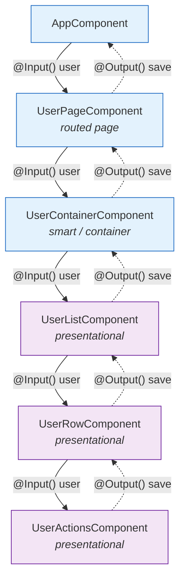
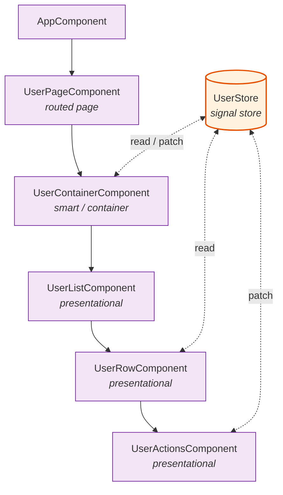
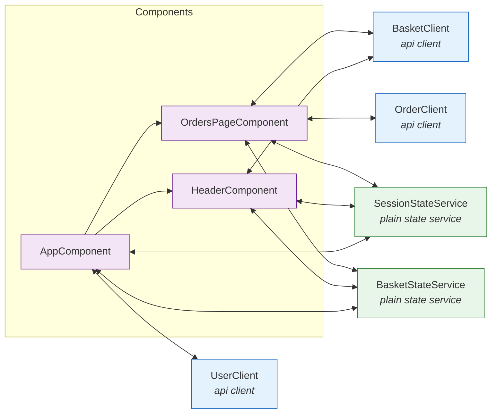
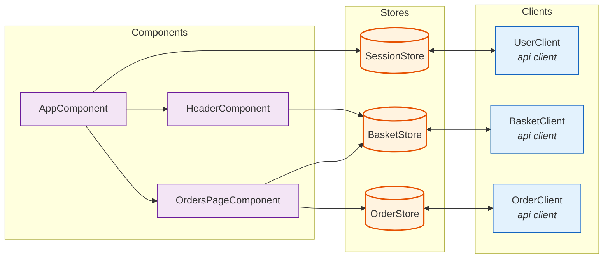
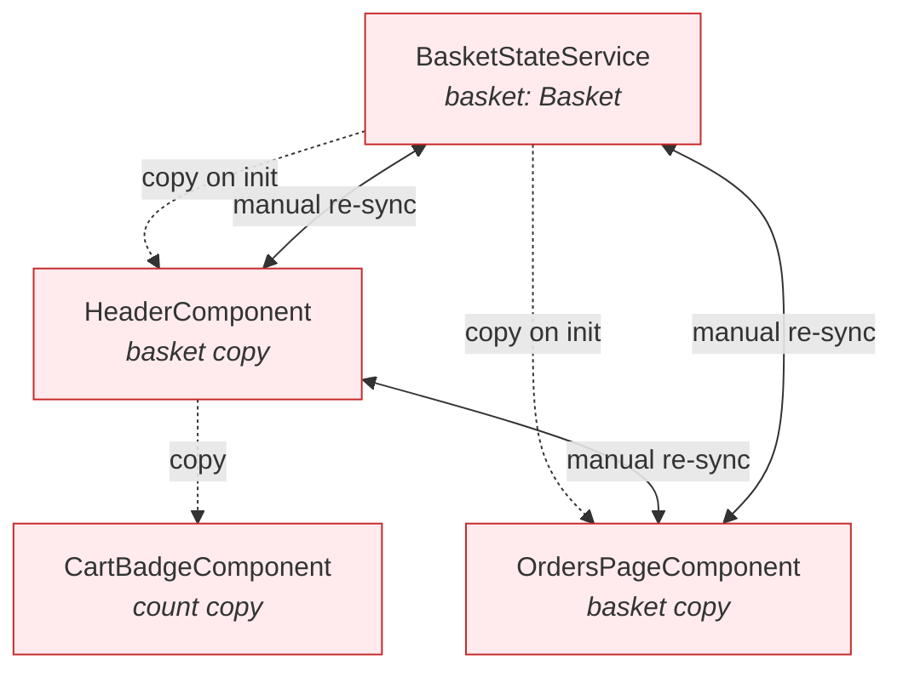
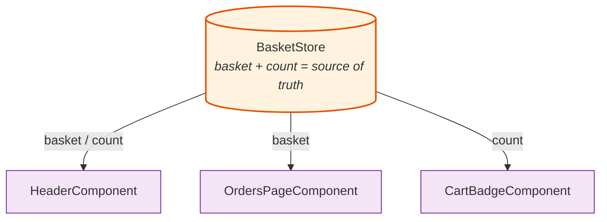
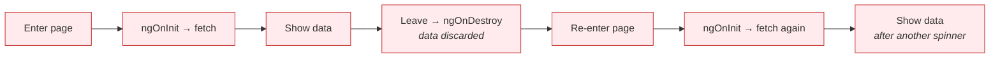
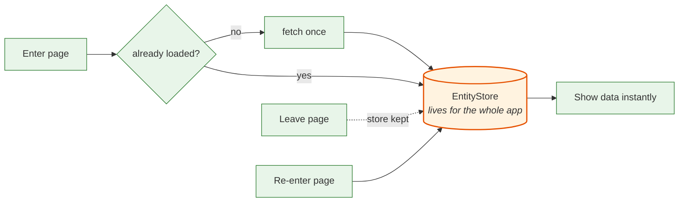

# Why and how to use a signal store

`@ngrx/signals` is a lightweight state management library from the makers of [@ngrx/store](https://ngrx.io/guide/store) & [@ngrx/effects](https://ngrx.io/guide/effects). This document explains why it is great and how it can enhance your angular codebase.

## What is the signal store ?

First, go read the docs, it'll take you less than half an hour I promise :

- [@ngrx/signals store documentation](https://ngrx.io/guide/signals)

In a few lines (TLDR):

- Signal Stores are where the data is at any given instant.
- They can be declared simply using a functional style.
- Instead of handling state either in services or in components, you handle it in the stores.
- It avoids a lot of spaghetti code and architecture smell.

Here's an example of the most simple Store you can have :

```TypeScript
type CounterState = {
    count: number;
}
const initialState = {
    count: 0,
}
export const CounterStore = signalStore(
    withState<CounterState>(initialState);
);
```

This is equivalent to the following native angular code :

```TypeScript
@Injectable()
class CounterStateService {
  private _count = signal<number>(0);
  public count = this._count.asReadOnly();
}
```

And yes, maybe you could do it better with state-focused native services, but the `@ngrx/signals` library enforces consistency and allow so much more.

## Issues that the store pattern solves

### Props drilling

**Without a store**:



The `user` data must be passed down through **every** intermediary component as
an `@Input()`, and every change must bubble back up through **every**
intermediary as an `@Output()`, even components that don't care about it. This
is called _props drilling_, and is an antipattern / code smell in component-based UI frameworks.

**With a store**:



With a store, only the components that actually use the data talk to it
directly, by reading its signals or calling `patchState`. The parent-child links
carry only composition, not data. Intermediary components stay agnostic.

### Spaghetti calls

**Without a Store**
Currently in a lot of places, it is very hard to see how the data flow, because components call the ApiClient directly, then store the result in shared "state" services.

Furthermore, the components trigger the fetch either in their `ngOnInit` methods, or worse, in `effect()` declaration, so it is hard to know when something was triggered.



Without a store, each component manages the triggering and the loading state (`loading` / `loaded` / `error`) of its own calls to the API clients.

The same request state logic is duplicated in every component, and there is no single place that owns it.

**With Stores:**



With a store, the async state is managed at the store level, which exposes async methods to fetch data (without exposing how the data is fetched).

It also decouples sibling components: `Header` and `OrdersPage` no longer talk to each other (via shared `Subject`s or `@Output` chains) to stay coordinated. They only read and patch the store, so a change made by one is seen by the other without any direct link between them.

### Centralized source of truth

**Without a store**, the same `basket` ends up copied in several places: a shared
state service, plus a local copy in each component that needed it at some point.
Nothing owns the "real" value, so the copies drift apart and have to be
re-synced by hand.



Three copies of the basket, kept in sync by ad-hoc arrows in every direction:
whenever one changes, someone has to remember to update the others, or the UI
shows stale data.

**With a store**, there is exactly one `basket`. Every component reads the same
signals (and derived `computed` values) straight from the store, so there is
nothing to keep in sync.



One value, read by everyone. Change it once via `patchState` and every consumer
updates automatically, because they all read the same signal.

Note that `count` here is a `computed` selector derived once inside the store, instead of each component recomputing it from the basket items — so the derivation logic lives in a single place and cannot diverge between consumers.

### State that outlives components

**Without a store**, the data lives in the component (or in a service whose value the component overwrites on init). It is fetched in `ngOnInit` and lost on `ngOnDestroy`, so navigating away and back re-fetches everything from scratch every single time.



**With a store** (`providedIn: 'root'`), the data lives in the store, whose lifetime is the application, not the component. The first visit fetches; later visits read what is already there and can refresh in the background — instant display, optional revalidation.



The store doubles as a cache: fetches can be skipped or deferred, and the UI stays populated across navigations.

### At a glance

| Concern                            | Without a store                                                                                    | With a store                                                                      |
| ---------------------------------- | -------------------------------------------------------------------------------------------------- | --------------------------------------------------------------------------------- |
| **Sharing data across components** | Threaded through every intermediary via `@Input()` / `@Output()` (props drilling)                  | Any component reads/patches the store directly; intermediaries stay agnostic      |
| **Data fetching & async state**    | Each component triggers its own calls and re-implements `loading`/`loaded`/`error`                 | The store owns fetching and call state; components just read signals              |
| **Source of truth**                | Same value copied into services and components, re-synced by hand                                  | One value; every consumer reads the same signal, nothing to sync                  |
| **State lifetime**                 | Tied to the component: fetched in `ngOnInit`, lost on `ngOnDestroy`, refetched on every navigation | Lives in a `providedIn: 'root'` store; survives navigation and doubles as a cache |

## Code details

For this part, suppose we have the following API client :

```TypeScript
type MyEntity = {
  id: number;
  // ...other fields
};

@Injectable({ providedIn: 'root' })
class EntityApiClient {
  private http = inject(HttpClient);

  fetchEntities(): Observable<MyEntity[]> {
    return this.http.get<MyEntity[]>(`/entities`);
  }
}
```

### Current issues (without Stores)

When not using the store pattern (we want to avoid this structure, inspired by the current state of the codebase).

We can currently find separate `StateService` in the codebase like:

```TypeScript
@Injectable({ providedIn: 'root' })
class EntityStateService {
  private _entities = signal<MyEntity[]>([]);
  entities = this._entities.asReadOnly();

  private _selectedEntityId = signal<number | undefined>(undefined);
  selectedEntity = computed(() =>
    this.entities().find((entity) => this._selectedEntityId() === entity.id),
  );

  setEntities(entities: MyEntity[]) {
    this._entities.set(entities);
  }

  selectEntity(id: number) {
    this._selectedEntityId.set(id);
  }
}
```

And then we're doing too many things in the components :

```TypeScript
@Component({
  selector: 'app-entities-page',
  template: `...`,
})
class EntitiesPageComponent implements OnInit {
  loading = signal<boolean>(false);
  error = signal<unknown>(undefined);

  private entityClient = inject(EntityApiClient);
  private entityService = inject(EntityStateService);

  ngOnInit() {
    this.error.set(undefined);
    this.loading.set(true);
    this.entityClient.fetchEntities().subscribe({
      next: (entities) => {
        this.loading.set(false);
        this.entityService.setEntities(entities);
      },
      error: (err: unknown) => {
        this.loading.set(false);
        this.error.set(err);
      },
    });
  }
}
```

Drawbacks of this approach:

- The component triggers fetches in `ngOnInit`, might cause unwanted refreshes and renders.
- With multiple entities needed by the component, this leads to spaghetti code.
- What if several components need the same entities ? Who owns the loading/error state ?

### Expected APIs (with a Store)

When you use the store pattern, you use functional APIs to declare them.

Each call of a `with*` method inside the `signalStore()` factory, will enhance the behavior of the store with features.

```TypeScript
import { computed, inject } from '@angular/core';
import {
  signalStore,
  withState,
  withComputed,
  withMethods,
  withProps,
  patchState,
} from '@ngrx/signals';
// call-state helpers come from the toolkit, NOT from @ngrx/signals core
import { withEntities, setAllEntities } from '@ngrx/signals/entities';
import {
  withCallState,
  setLoading,
  setLoaded,
  setError,
} from '@angular-architects/ngrx-toolkit';
import { firstValueFrom } from 'rxjs';

type EntityState = {
  selectedEntityId: number | undefined;
};

const initialState: EntityState = {
  selectedEntityId: undefined,
};

export const EntityStore = signalStore(
  { providedIn: 'root' },
  withState<EntityState>(initialState), // exposes the `store.selectedEntityId()` signal
  withEntities<MyEntity>(), // gives `store.entities()` and immutable ways to patch the collection
  withCallState(), // gives us store.loading() / store.loaded() / store.error()
  withComputed((store) => ({
    selectedEntity: computed(() =>
      store.entities().find((entity) => store.selectedEntityId() === entity.id),
    ),
  })),
  // utility to add fields to a store, here we can inject angular services
  withProps(() => ({
    apiClient: inject(EntityApiClient),
  })),
  // add methods to the store
  withMethods((store) => ({
    /** the async method here returns nothing so that users do not modify them */
    fetchEntities: async () => {
      patchState(store, setLoading());
      try {
        const result = await firstValueFrom(store.apiClient.fetchEntities());
        patchState(store, setAllEntities(result), setLoaded());
      } catch (err) {
        patchState(store, setError(err));
      }
    },
  })),
);
```

Then the component becomes simpler :

```TypeScript
@Component({
  selector: 'app-entities-page',
  template: `
    @if (store.loading()) {
      Loading...
    } @else if (store.error()) {
      Something went wrong.
    } @else {
      <app-entities-list [entities]="store.entities()" />
    }
  `,
})
class EntitiesPageComponent {
  protected readonly store = inject(EntityStore);

  constructor() {
    // Triggering can now also happen in a route guard or resolver instead.
    this.store.fetchEntities();
  }
}
```

## Advantages of the Store pattern

- It forces you to make simple components with single responsibility and gives you another brick (besides angular ones) to solve problems.
- You always have the answer to the question "where is the data for this `{Entity}` I need?": it's in the `{Entity}Store`.
- It abstracts the data fetching: the store manages the async part (either with `Promise` or `Observable`), and components just need to subscribe to signals (`store.loading()`/`store.loaded()`/`store.error()`) for call state, and display data accordingly (with custom `store.entity()` or `store.entities()`.)
  - This gives the flexibility to trigger fetches at the route level (in guards and resolver) instead of in the component.
- The data in stores are not linked to the lifecycle of a component, or pages, so they can stay between navigations. The store can serve as cache for faster display / optimistic UI.
- Extensible ecosystem, with dev tools and reusable features with [ngrx-toolkit](https://ngrx-toolkit.angulararchitects.io/docs/extensions) or [ngrx-traits](https://ngrx-traits.dev/)
- [time-travel debugging](https://www.youtube.com/watch?v=xsSnOQynTHs) with [redux devtools](https://chromewebstore.google.com/detail/redux-devtools/lmhkpmbekcpmknklioeibfkpmmfibljd?hl=en).

## When not to use a store, and other drawbacks

- When the state is local to a single component, keep stuff locally.
- When your app is simple enough that you don't need to think about state and async coordination.
- You don't care about consistency in your codebase.
