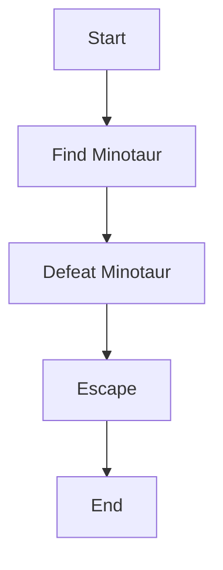

Inspiré par le mythe du Minotaure, Minotaur est un jeu de type rogue-lite dans lequel le joueur doit explorer un labyrinthe généré aléatoirement.
Le but est de trouver le Minotaure et de le vaincre pour s'échapper du labyrinthe.

